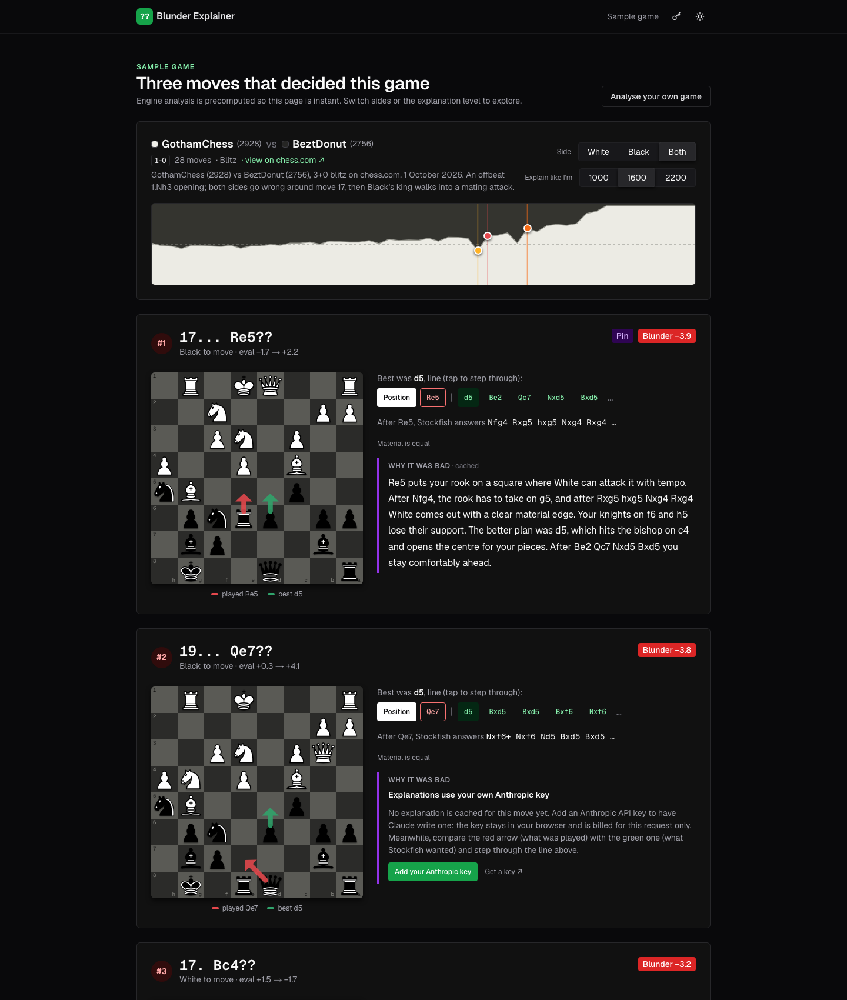
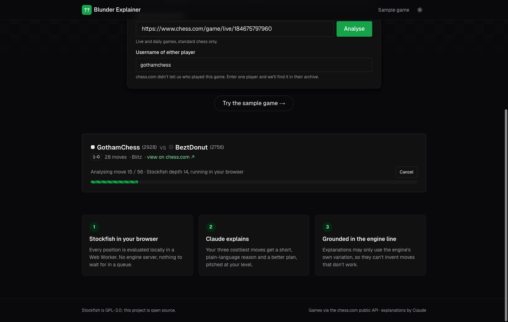

# Blunder Explainer

**Live:** https://blunder-explainer.vercel.app (no setup needed: [sample game](https://blunder-explainer.vercel.app/sample))



Paste a chess.com game. Stockfish analyses every position **in your browser**, finds the three moves that cost the most, and Claude explains each one in plain language: why it was bad, what the opponent's punishing reply is, and the better plan. The explanation is grounded in the engine's lines, so it can't invent tactics.

**Try it:** the [sample game](https://blunder-explainer.vercel.app/sample) is preloaded and needs no key. New explanations use **your own Anthropic API key** (bring your own key; the site owner pays for nothing).

**Eval:** a 40-position test set with known answers, a Claude grader and a runner, all in [`eval/`](eval/README.md). A run costs about $1 of API credit; the score is not published yet (see [What I'd do next](#what-id-do-next)).

## Why

Every chess site shows you an evaluation graph and a "best move". Neither tells you *why* your move lost, and a bare engine line like `Nfg4 Rxg5 hxg5 Nxg4` is unreadable below about 1800 rating. LLMs can explain, but left alone they invent tactics that aren't on the board. This project is the boring, engineering version of "ask an AI about my game": the engine decides what's true, the model only puts it into words, and an eval measures how often it gets that right.

## How it works

1. **Input.** A chess.com game URL, a chess.com username (pick from recent games), or a pasted PGN. chess.com has no official single-game endpoint, so the server reads the players from the game page's JSON and then takes the PGN from the **official** monthly archive API, matched by URL.
2. **Engine in the browser.** Stockfish 19 (lite, single-threaded WASM, 1.8 MB) runs in a Web Worker with a small `Engine` class: UCI over `postMessage`, one position at a time, sent with its full move history so repetition draws are recognised. A 146-ply blitz game takes about 5 s on a laptop, with a progress bar and Cancel.

   

3. **Blunder detection.** Centipawn loss from the mover's perspective (sign flipped for Black). Mate scores are mapped to large numbers and never averaged. Moves are ranked by **lost winning chances** (the Lichess win-probability curve), so a slip in an already-lost position doesn't outrank the move that decided the game.
4. **Grounded explanation.** The client sends only a FEN, UCI moves and numbers. The server **re-derives everything**: it checks the move is legal, replays the engine line until the first illegal move, and computes SAN, material and side to move itself. So no free text from the browser can reach the prompt. The prompt gets the move played, the engine's best line, the opponent's refutation, the evaluation before and after, and strict rules: only moves from the given lines, 80 words or fewer, one reason and one plan. The model answers with a one-line JSON header (`{"theme":"pin"}`) followed by prose, streamed into the card as it's written.
5. **Cache.** Every explanation is stored in Postgres, keyed by position, move, level and a hash of the prompt. Repeated views cost nothing, and editing the prompt can never serve stale text.

## Prompt versions

[`prompts/v1.ts`](prompts/v1.ts) is the baseline: "you're a coach, explain the mistake", with the FEN, the move, the engine's best move and the evals. [`prompts/v2.ts`](prompts/v2.ts) is the grounded version:
- the full principal variation and the refutation in SAN
- evals labelled from the mover's perspective
- material balance
- an explicit rule never to mention a move that isn't in the given lines
- a word limit
- vocabulary tuned to the 1000 / 1600 / 2200 slider
- few-shot examples taken from real Stockfish output

v2's stable prefix is also long enough for prompt caching to apply.

## Bring your own key

Visitors paste their Anthropic key in a dialog. It stays in their browser and is sent only as a header on the explain request. The server uses it for that one call and never stores or logs it. Tests check this by watching `console.*` and the database. Explanations generated with a visitor's key are cached as plain text, so the next visitor sees them for free. Why the key goes through the server instead of calling Anthropic from the browser: the server has to build the grounded prompt and be the only writer to the shared cache, so the cache can't be poisoned. Details and threat model: [`docs/byok.md`](docs/byok.md).

## Run it

```bash
pnpm install                 # also copies the Stockfish build into public/engine
cp .env.example .env.local
pnpm db:local                # real Postgres from npm on :5434 (own terminal), or set DATABASE_URL to Neon
pnpm db:migrate
pnpm dev                     # http://localhost:3000, /sample works immediately
```

`pnpm test` runs Vitest (230 tests: chess math, the UCI parser, chess.com parsing against fixtures, prompt grounding, the explain and game routes with mocked upstreams, key handling, rate limits). The 4 DB-backed tests use `TEST_DATABASE_URL` and are skipped without it. The eval: `ANTHROPIC_API_KEY=… pnpm eval --prompt v2`.

## Stack

Next.js 16 (App Router) on Vercel · Chakra UI v3 · Stockfish 19 WASM in a Web Worker · chess.js · Anthropic SDK (`claude-sonnet-5-5` explains, `claude-opus-5-5` grades the eval, server-side refusal fallbacks enabled) · Drizzle + Neon Postgres · Vitest. Board: my own board component (pieces from react-chessboard), shared with my portfolio.

## What I'd do next

- Run the eval for v1 and v2 and put the before/after score in this README. That one paragraph is the point of the project.
- Use a lower-rated sample game: a 2900-vs-2750 blitz game's mistakes are instructive, but beginner blunders show the explainer better.
- Explain the critical moment as well as the worst moves, i.e. the position where the evaluation first swung.
- Step through the refutation on the board with arrows animating ply by ply.
- Pass the opponent's rating into the prompt so a 1000-rated player isn't told about a 12-move combination.

## Licence

GPL-3.0, because the app serves Stockfish's GPL WASM build. The test set uses Lichess puzzle data (CC0).
